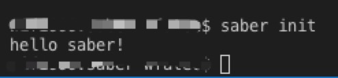
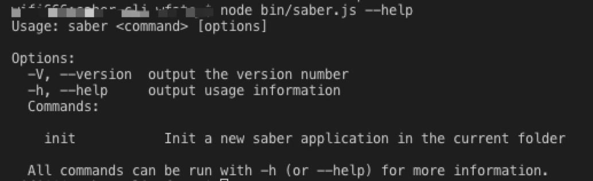

<!-- TOC -->

- [搭建 saber-cli 工具](#搭建-saber-cli-工具)
    - [hello saber](#hello-saber)
    - [输出基本信息](#输出基本信息)
        - [--version](#--version)
        - [--help](#--help)

<!-- /TOC -->

# 搭建 saber-cli 工具

> 声明：本文参考了 [dva-cli](https://github.com/dvajs/dva-cli) 的部分源码

## hello saber

1. 安装所需依赖 commander：

```
yarn add commander
```

2. 在 `package.json` 中添加 `bin` 字段：

```js
// ...
"bin":{
    "saber": "./bin/saber-cli.js"
}
```

其中 `saber` 为 cli 的名称，`./bin/saber-cli.js` 为执行 `saber` 命令时调用的文件地址。

3. 实现 `saber-cli.js`

在 bin 下添加 `saber-cli.js`。添加内容：

```javascript
#!/usr/bin/env node
const program = require("commander");

/**
 * project init
 */
program
  .command("init")
  .description("project init")
  .action(() => {
    console.log("hello saber");
  });
```

其中 `#!/usr/bin/env node` 必须在文件开头定义，用于让不同的操作系统找到自己的解释器，具体可参考[#!/usr/bin/env node 到底是什么？](https://juejin.im/post/5cb93cd651882578b148c637)。

剩余部分就是 commander 的用法，具体可参考[这里](https://github.com/tj/commander.js/)

4. 执行 `npm link`

`npm link` 命令可以将一个任意位置的 npm 包链接到全局执行环境，从而在任意位置使用命令行都可以直接运行该 npm 包。以 mac 为例，执行之后，会在 `/usr/local/bin` 文件夹下新建一个名为 `saber` 的替身文件。

5. 执行 `saber init`

在任意位置的命令行下，执行 `saber init`，结果如下：



好了，我们已经实现了一个简单的 cli 工具，是不是非常容易呢！

## 输出基本信息

作为 cli 工具，我们需要能够输出当前的版本号以及帮助信息，幸运的是，基于 commander 我们能够很容易的做到这一点。

### --version

首先我们来实现输出当前版本号的功能。

1. 引入 `package.json`

```js
const pkg = require("../package.json");
```

2. 注册 version 命令

```js
program.version(pkg.version);
```

完事了？

是的，就这么简单，让我们来测试一下：

```
node bin/saber.js --version
```

输出结果为：`0.0.1`。

> 注意：在开发过程中，我们不必每次更改都执行 `npm link` 操作，而是可以直接调用 node 命令来简化测试过程。

实际上，commander 还为我们提供了 `-V` 的简化写法，甚至可以自定义命令！具体可自行查阅官方文档。

### --help

与 version 命令类似，help 命令的定义也一场简单：

```js
const printHelp = () => {
  console.log("  Commands:");
  console.log();
  console.log(
    "    init           Init a new saber application in the current folder"
  );
  console.log();
  console.log(
    "  All commands can be run with -h (or --help) for more information."
  );
};
program
  .usage("<command> [options]")
  .on("--help", printHelp)
  .parse(process.argv);
```

其中 usage 会在执行 help 时打印出来，表示 cli 的基本用法，on 用来监听 help 命令，并执行 printHelp 函数，parse 用于解析命令行参数到 program，便于后续调用。

输入 `node bin/saber.js --help` 测试一下，结果如下：


